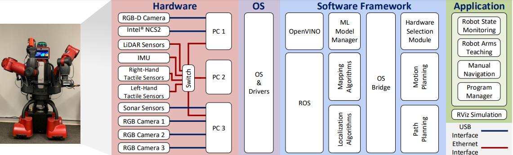
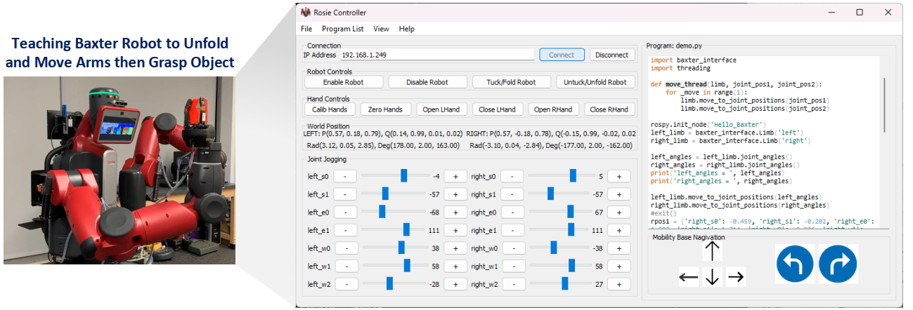
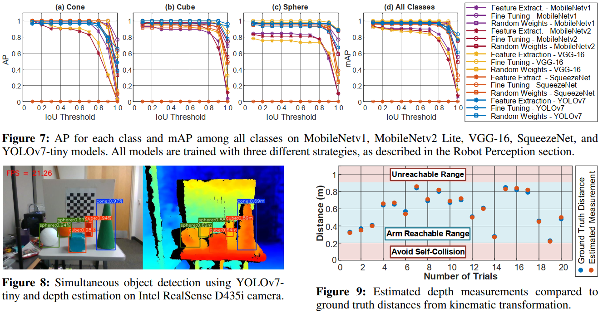

## PerFc: An Efficient 2D and 3D Perception Software-Hardware Framework for Mobile Cobot

[Project Page](https://github.com/tuantdang/perception_framework) | [Paper]() | [Video Demo](https://www.youtube.com/watch?v=q4oz9Rixbzs&ab_channel=TuanDang)

## Author Information
- [Tuan Dang, UT Arlington, USA](https://www.tuandang.info/)
- [Khang Nguyen, UT Arlington, USA](https://mkhangg.com/)
- [Manfred Huber, UT Arlington, USA](https://www.uta.edu/academics/faculty/profile?username=huber)

 <p align="center">

</p>

## Abstract

 
## Graphic User Interface


</p>
 
 - Remote Control Co-bot using wireless connection (TCP/IP)
- Basic Control: Tuck/Untuck, Enable/Disable
- Joint Teaching
- World Position Monitor and Transformation
- Base control: Move Left/Right/Backward/Forward, Turn Left/Right
- Python download and execute on Robot
<p align="center">

 ## Results
<p align="center">

</p>


## Software Requirements
- Run distributed computers 
- Perform Machine Learning tasks using Onboard Intel GPU
- ROS Indigo Or Melodic
- Ubuntu 16.04 or 20.04 
- Python 2.7, 3.7 or above
- C/C++

## Acknowledgments


 
## Citing
```
To be included!
```


